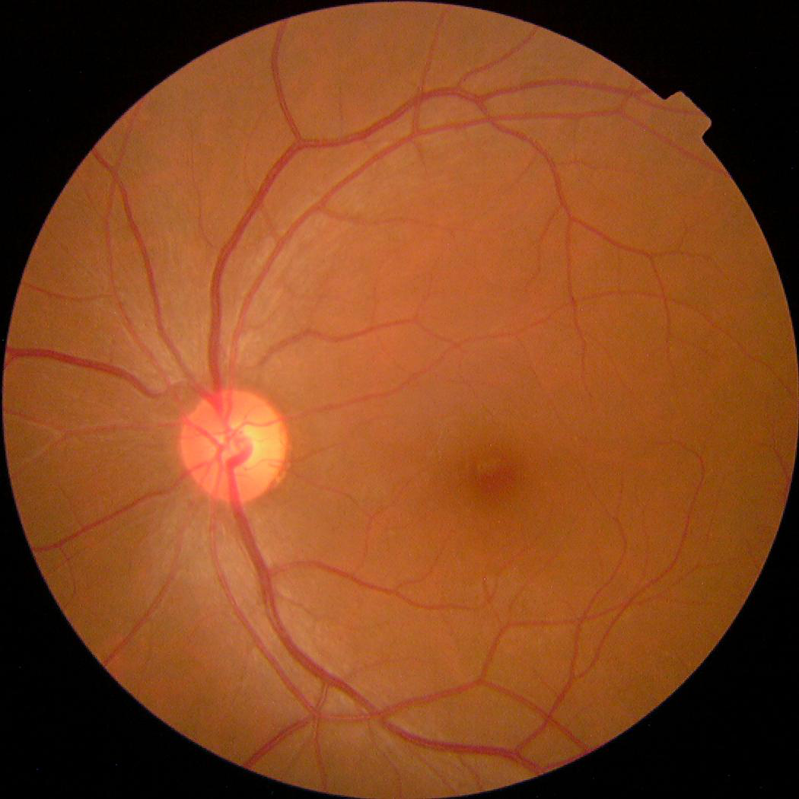

# 📊 Dataset Overview: APTOS 2019 Blindness Detection

## 🔍 About the Dataset

For this project, I utilized the publicly available **APTOS 2019 Blindness Detection Dataset**, hosted on [Kaggle](https://www.kaggle.com/competitions/aptos2019-blindness-detection). This dataset was released as part of a global competition organized by the **Asia Pacific Tele-Ophthalmology Society (APTOS)**, aiming to advance the field of automated diabetic retinopathy (DR) detection.

The dataset comprises **retinal fundus images** captured using a variety of imaging equipment under varying conditions. These images reflect **real-world clinical variability**, including differences in resolution, lighting, and patient eye conditions (e.g., presence of cataracts), providing a challenging but valuable resource for model development.

The objective is to classify these images into **five distinct levels of diabetic retinopathy severity**, ranging from no DR to advanced proliferative stages. Automated systems trained on this dataset are expected to assist ophthalmologists in **early detection**, **grading**, and **management** of diabetic retinopathy, ultimately reducing the risk of vision loss in diabetic patients.

---

## 📁 Dataset Source

- **Competition Page:** [APTOS 2019 Blindness Detection](https://www.kaggle.com/competitions/aptos2019-blindness-detection)
- **Dataset Files:** [Download Here](https://www.kaggle.com/competitions/aptos2019-blindness-detection/data)
- **Organized by:** Asia Pacific Tele-Ophthalmology Society (APTOS)

All credit for the data collection and preparation goes to APTOS and their partners. This dataset is used solely for educational and research purposes.

---

## 🏷️ Diabetic Retinopathy Severity Levels & Class Distribution

The dataset categorizes each image into **five severity levels**:

| Class | Severity Description              |
|-------|-----------------------------------|
| 0     | No diabetic retinopathy (No DR)   |
| 1     | Mild non-proliferative DR         |
| 2     | Moderate non-proliferative DR     |
| 3     | Severe non-proliferative DR       |
| 4     | Proliferative DR                  |

> In diabetic retinopathy, **early stages** may present with microaneurysms, while **advanced stages** (proliferative DR) involve abnormal new blood vessel growth, posing a risk of severe vision loss.

### ⚖️ **Dataset Class Distribution:**

The dataset is **imbalanced**, reflecting the natural prevalence of diabetic retinopathy in the population:

| Class | Description                    | Image Count | Percentage (%) |
|-------|--------------------------------|-------------|----------------|
| 0     | No DR                          | 1805        | 50.19%         |
| 1     | Mild DR                        | 370         | 10.28%         |
| 2     | Moderate DR                    | 999         | 27.77%         |
| 3     | Severe DR                      | 193         | 5.36%          |
| 4     | Proliferative DR                | 295         | 8.20%          |

_Total images: 3662_

> This imbalance highlights the importance of **careful sampling strategies** and **data augmentation techniques** during model training.

---

## 🖼️ Sample Images from the Dataset

| Sample Image 1                            | Sample Image 2                             |
|-------------------------------------------|--------------------------------------------|
|          |         |

> _Sample retinal fundus images from the dataset.

---

## 📚 Acknowledgment

I would like to acknowledge the **Asia Pacific Tele-Ophthalmology Society (APTOS)** for providing this valuable dataset. This dataset has been instrumental in enabling research and experimentation toward the early detection of diabetic retinopathy using machine learning models.

For more details, visit the [APTOS 2019 Blindness Detection Competition](https://www.kaggle.com/competitions/aptos2019-blindness-detection).

---
---

## 🛠️ Preprocessing Pipeline Overview

1. **Mount Google Drive:** Accessed dataset and saved processed images directly to Drive.

2. **Image Format Conversion:** Converted `.png` to `.jpeg`.

3. **Image Cleaning & Quality Filtering:**
   - Removed blurry, dark, annotated, or glare-affected images.
   - Standardized image orientation (auto-flip left eyes).
   - Enhanced contrast with **CLAHE**.
   - Resized to **512x512** pixels and normalized.

4. **Class Distribution Analysis:** Verified label consistency after cleaning.

5. **Dataset Balancing:**
   - Binary labels: `No DR` (0) and `DR` (1).
   - Balanced the dataset via undersampling.

6. **Organized Dataset Structure:**
   - Created **unbalanced** and **balanced** splits.
   - Organized images into `DR/` and `NoDR/` folders.

7. **Generated CSVs:**
   - `train_cleaned.csv`, `train_unbalanced_split.csv`, `train_balanced.csv`.

---

