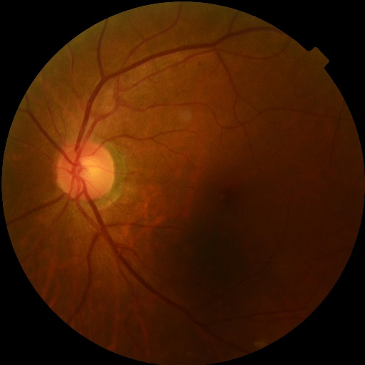
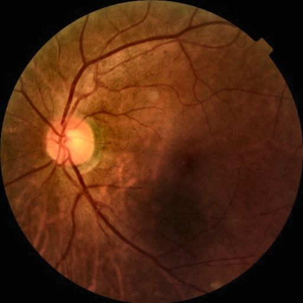

# 📊 Dataset Overview: DDR - Diabetic Retinopathy Detection Dataset

## 🔍 About the Dataset

For this project, I utilized the **DDR (Diabetic Retinopathy Detection) Dataset**, available on [Kaggle](https://www.kaggle.com/datasets/mariaherrerot/ddrdataset). This dataset was designed to support the development of AI-based models for the detection and grading of **diabetic retinopathy (DR)** using **fundus images**.

The dataset consists of **high-resolution retinal fundus images** captured under different clinical settings. It provides annotations for various **DR severity levels**, aiming to enhance the diagnosis process by assisting ophthalmologists in identifying the progression of diabetic retinopathy.

---

## 📁 Dataset Source

- **Dataset Page:** [DDR Dataset on Kaggle](https://www.kaggle.com/datasets/mariaherrerot/ddrdataset)
- **Provided by:** Maria Herrero-Toro

_All credit for data collection and preparation goes to the dataset creators. This dataset is used strictly for research and educational purposes._

---

## 🏷️ Diabetic Retinopathy Severity Levels & Class Distribution

| Class | Severity Description              |
|-------|-----------------------------------|
| 0     | No diabetic retinopathy (No DR)   |
| 1     | Mild non-proliferative DR         |
| 2     | Moderate non-proliferative DR     |
| 3     | Severe non-proliferative DR       |
| 4     | Proliferative DR                  |

**Class distribution in DDR dataset:**

| Class | Description                    | Image Count |
|-------|--------------------------------|-------------|
| 0     | No DR                          | 757         |
| 1     | Mild DR                        | 244         |
| 2     | Moderate DR                    | 524         |
| 3     | Severe DR                      | 135         |
| 4     | Proliferative DR                | 130         |

_Total images: 1790_

---

## 🛠️ Preprocessing Pipeline Overview

1. **Mount Google Drive:**  
   Accessed and stored the dataset for persistent operations.

2. **Image Format Conversion:**  
   Converted original **TIFF, PNG, JPG** formats to **JPEG** for consistency.

3. **Metadata Preparation:**  
   Generated an **updated CSV file** linking each image (`filename`) to its DR label (`diagnosis`).

4. **Image Cleaning & Quality Filtering:**  
   - Removed low-quality images based on:
     - **Blur detection** (Laplacian variance threshold).
     - **Brightness threshold** (discarded overly dark images).
   - Removed:
     - **Black borders**.
     - **Annotations/text**.
     - **Glare** (bright white spots).
     - **Dark regions** (poor illumination).
   - **Auto-flipped left-eye images** for orientation consistency.
   - Enhanced contrast with **CLAHE**.
   - Resized all images to **512x512 pixels** and **normalized pixel values** to **[-1, 1]**.

5. **Class Distribution Analysis:**  
   Verified the **distribution of DR classes** post-cleaning.

6. **Dataset Balancing:**  
   - Created **binary labels** (`No DR` = 0, `DR` = 1).
   - Performed **undersampling** to balance classes.

7. **Organized Dataset Structure:**
   - **Unbalanced Split:**
     - Separated images into:
       - `NoDR/`
       - `DR/`
   - **Balanced Split:**
     - Performed undersampling and split images into:
       - `DDR_Balanced_Split/NoDR/`
       - `DDR_Balanced_Split/DR/`

8. **Generated CSV Files:**
   - `DR_grading_updated.csv` (JPEG filenames)
   - `DR_grading_cleaned.csv` (cleaned images)
   - `DR_Unbalanced_Split.csv` (binary labels)
   - `DR_grading_balanced.csv` (balanced dataset)

---

## 🖼️ Before vs. After Preprocessing

| Original Image (Before)                      | Processed Image (After)                   |
|----------------------------------------------|-------------------------------------------|
|  |  |

> _A comparison between a raw fundus image (left) and the same image after preprocessing steps (right), showing border removal, contrast enhancement, and glare filtering._

---

## 📚 Acknowledgment

I would like to acknowledge **Maria Herrero-Toro** and the **DDR dataset creators** for making this valuable dataset available on Kaggle. Their contribution enables research and experimentation for advancing automated diabetic retinopathy detection.

