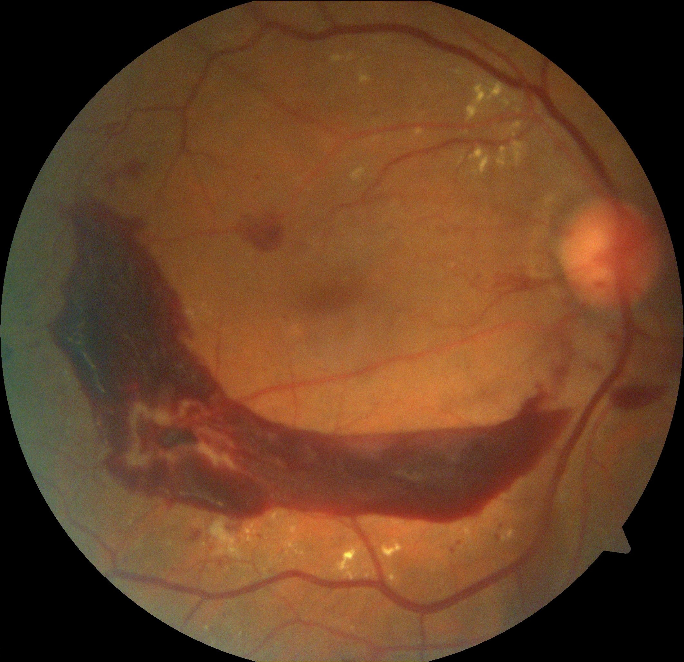
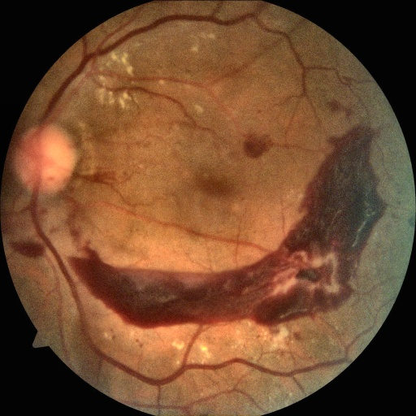

# 📊 Dataset Overview: HRF - High-Resolution Fundus Image Dataset

## 🔍 About the Dataset

For this project, I utilized the **High-Resolution Fundus (HRF) Image Dataset**, available at [FAU](https://www5.cs.fau.de/research/data/fundus-images/). This dataset provides **high-resolution retinal fundus images** for medical image analysis tasks like **diabetic retinopathy (DR) detection**, **glaucoma detection**, and **vessel segmentation**.

The DR annotations are **manually labeled**, offering valuable data for training and evaluating models aimed at automating **diabetic retinopathy detection**.

---

## 📁 Dataset Source

- **Dataset Page:** [FAU HRF Dataset](https://www5.cs.fau.de/research/data/fundus-images/)
- **Provided by:** Pattern Recognition Lab, Friedrich-Alexander-Universität Erlangen-Nürnberg (FAU)

_All credit for data collection and preparation goes to the dataset creators. This dataset is used strictly for research and educational purposes._

---

## 🏷️ Diabetic Retinopathy Severity Levels & Class Distribution

| Class | Severity Description              | Image Count |
|-------|-----------------------------------|-------------|
| 0     | No diabetic retinopathy (No DR)   | 20          |
| 1     | Mild non-proliferative DR         | 4           |
| 2     | Moderate non-proliferative DR     | 58          |
| 3     | Severe non-proliferative DR       | 175         |
| 4     | Proliferative DR                  | 139         |

_Total images: 396_

> _Severe NPDR and Very Severe NPDR were combined into **Class 3 (Severe DR)**.  
> PDR and Advanced PDR were combined into **Class 4 (Proliferative DR)**._

---

## 🛠️ Preprocessing Pipeline Overview

1. **Image Format Conversion:**  
   - Converted **TIFF, PNG, JPG** formats to **JPEG** for consistency.

2. **Metadata Preparation:**  
   - Used the **Excel annotations** to generate a **CSV file** linking each image (`filename`) to its DR label.

3. **Image Cleaning & Quality Filtering:**  
   - Removed low-quality images based on:
     - **Blur detection** (Laplacian variance threshold).
     - **Brightness threshold** (discarded overly dark images).
   - Removed:
     - **Black borders**.
     - **Annotations/text**.
     - **Glare** (bright white spots).
     - **Dark regions** (poor illumination).
   - **Auto-flipped left-eye images** for orientation consistency.
   - Enhanced contrast with **CLAHE**.
   - Resized all images to **512x512 pixels** and **normalized pixel values** to **[-1, 1]**.

4. **Class Distribution Analysis:**  
   - Verified the **distribution of DR classes** post-cleaning.

5. **Dataset Balancing:**  
   - Created **binary labels** (`No DR` = 0, `DR` = 1).
   - Performed **undersampling** to balance classes.

6. **Organized Dataset Structure:**
   - **Unbalanced Split:**
     - Separated images into:
       - `NoDR/`
       - `DR/`
   - **Balanced Split:**
     - Performed undersampling and split images into:
       - `Balanced_Split/NoDR/`
       - `Balanced_Split/DR/`

7. **Generated CSV Files:**
   - `hrf_grading_cleaned.csv` (cleaned images)
   - `hrf_grading_balanced.csv` (balanced dataset)

---

## 🖼️ Before vs. After Preprocessing

| Original Image (Before)                          | Processed Image (After)                     |
|--------------------------------------------------|---------------------------------------------|
|    |  | 

> _Comparison between a raw high-resolution fundus image (left) and the same image after preprocessing (right), showcasing border removal, contrast enhancement, and glare filtering._

---

## 📚 Acknowledgment

I would like to acknowledge the **Pattern Recognition Lab at FAU** for providing the **HRF dataset**. Their contribution enables research and experimentation in advancing automated diabetic retinopathy detection and medical image analysis.
