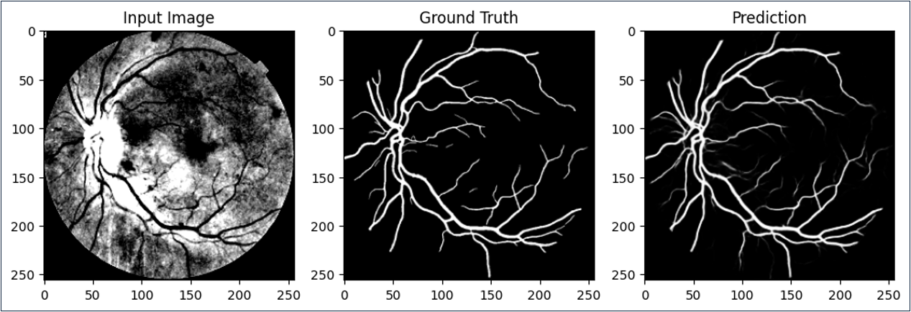

# RetinaLab: The All-in-One Diabetic Retinopathy Research Platform

Welcome to **RetinaLab**, your **comprehensive toolkit** for **Diabetic Retinopathy (DR) research**. This platform offers **state-of-the-art machine learning models** to support DR research, image generation, vessel segmentation, binary classification, and research assistance.

Whether you're a **data scientist**, **ophthalmologist**, or **researcher**, RetinaLab provides an **easy-to-use interface** and **powerful tools** to advance DR research.

---

## 🚀 Key Features

1. **Fundus Image Generation**:  
   - **Two StyleGAN3 models** (one for **DR** and one for **No_DR** fundus images).  
   - Generate **realistic synthetic images** to address **data scarcity**, **imbalance**, and **privacy concerns**.  
   - **FID Scores**:
     - **DR Model**: 18.97
     - **No_DR Model**: 23.29  
   - **Expert Validation** by doctors of Ophthalmology.

2. **Vessel Map Generation**:  
   - **DA-Res2UNet** model for **retinal vessel segmentation**.  
   - High-performance metrics:
     - **Dice Coefficient**: 84.25%
     - **Accuracy**: 98.05%
     - **Sensitivity (Recall)**: 79.91%
     - **Specificity**: 99.32%

3. **Binary DR Detection (DR vs No_DR)**:  
   - **RSGNet** model trained on diverse datasets.  
   - Current **validation accuracy**: 75% (requires further improvement for deployment).

4. **GPT-4o Mini Chatbot Assistance**:  
   - Finetuned **GPT-4o mini** for **research Q&A**.  
   - Embeds **DR research documents** using **text-embedding-ada-002** and retrieves relevant context.  
   - Provides **contextual answers** to assist DR researchers.

---

## 🏗️ Model Architectures

### 1. **StyleGAN3-t: Fundus Image Generator**

- **Purpose**: Generate **synthetic DR** and **No_DR** fundus images.  
- **Datasets**: EyePACS, DDR, APTOS, Messidor-2, IDRiD.  
- **Preprocessing**:
  - Cropping, CLAHE, glare/blur detection, annotation removal, resizing to **512x512**.  
- **Training Parameters**:
  - **Batch Size**: 32
  - **Gamma**: 8.2
  - **Generator LR**: 0.002
  - **Discriminator LR**: 0.002
  - **Adaptive Augmentation Target**: 0.4
  - **Training Length**: ~760k images

### 2. **DA-Res2UNet: Vessel Map Generator**

- **Purpose**: Segment **retinal vessels** from fundus images.  
- **Datasets**: DRIVE, CHASEDB1, ARIA, FIVE, HRF.  
- **Preprocessing**:
  - Green channel extraction, gamma correction, CLAHE, sharpening, binarization, resizing to **256x256**.  
- **Architecture Components**:
  - **Res2Blocks**: Multi-scale residual blocks.  
  - **DropBlock Regularization**: Spatial dropout.  
  - **Dual Attention (PAM + CAM)**: Spatial and channel attention.  
  - **Spatial Attention** for further refinement.  
- **Training Parameters**:
  - **Loss**: BCELoss
  - **Optimizer**: Adam (LR: 0.01)
  - **Scheduler**: CosineAnnealingLR (T_max=40)
  - **Batch Size**: 8
  - **Epochs**: 40

### 3. **RSGNet: DR Grader (Binary Detection)**

- **Purpose**: Classify fundus images as **DR** or **No_DR**.  
- **Datasets**: EyePACS, DDR, APTOS, Messidor-2, IDRiD.  
- **Preprocessing**:
  - CLAHE, glare/blur detection, annotation removal, resizing to **224x224**.  
- **Training Parameters**:
  - **Loss**: BCELoss
  - **Optimizer**: Adam (LR: 0.001)
  - **Batch Size**: 32
  - **Epochs**: 30  
- **Current Performance**:
  - **Validation Accuracy**: 75%  
  - *Requires further tuning and medical assessment.*

### 4. **GPT-4o Mini Research Chatbot**

- **Purpose**: Assist DR researchers with **contextual Q&A**.  
- **Embedding Model**: `text-embedding-ada-002`.  
- **Retrieval Mechanism**: Cosine similarity search to retrieve **relevant research documents**.  
- **Language Model**: Finetuned **GPT-4o mini** for DR domain knowledge.

---

## 📊 Evaluation Summary

| Model                | Metric          | Value        |
|----------------------|-----------------|--------------|
| **StyleGAN3 (DR)**   | **FID**         | **18.97**    |
| **StyleGAN3 (No_DR)**| **FID**         | **23.29**    |
| **DA-Res2UNet**      | **Dice**        | **84.25%**   |
|                      | **Accuracy**    | **98.05%**   |
|                      | **Sensitivity** | **79.91%**   |
|                      | **Specificity** | **99.32%**   |
| **RSGNet**           | **Val Accuracy**| **75%**      |

---

## 🔮 Future Directions

- **Model Enhancements**:
  - Move from **binary** to **multi-class DR grading**.  
  - Explore **diffusion models**, **visual language models (VLMs)**, and **explainability techniques**.  

- **New Features**:
  - **Image denoising**.  
  - **Image-to-image translation** (e.g., fundus → vessel map).  
  - Support for **larger input sizes** (including **zip files**).  

---

## 📚 References

1. **StyleGAN3**: [https://github.com/NVlabs/stylegan3](https://github.com/NVlabs/stylegan3)  
2. **Res2Net**: [https://arxiv.org/abs/1904.01169](https://arxiv.org/abs/1904.01169)  
3. **Dual Attention Network**: [https://arxiv.org/abs/1809.02983](https://arxiv.org/abs/1809.02983)  
4. **DropBlock Regularization**: [https://arxiv.org/abs/1810.12890](https://arxiv.org/abs/1810.12890)  
5. **GPT-4o-mini**: [https://openai.com](https://openai.com)  
6. **Datasets**: EyePACS, DDR, APTOS, Messidor-2, IDRiD, DRIVE, CHASEDB1, ARIA, HRF, FIVE.

---

⚠️ **Disclaimer**: All models in RetinaLab are intended for **research purposes only** and are **not validated for clinical use**.


---

## 🖼️ Some Results from Our Generative Models

Below are sample images generated by our **StyleGAN3 models**:


<p align="center">
  
  
  
</p>

---

## 🧩 Segmentation Model Result

Below is an example of a **vessel segmentation output** generated by our **DA-Res2UNet** model:

<p align="center">
  
</p>

---

## 🚀 How to Run the Website (with Docker)

1. **Install Docker and Docker Compose**

   - Download and install [Docker Desktop](https://www.docker.com/products/docker-desktop/).
   - Confirm installation:
   
   ```bash
   docker --version
   docker compose version

✅ You should see the versions.

2. **Clone the Project**
   
   ```bash
   git clone --branch website --single-branch https://github.com/JanaAY/EECE490.git
   cd EECE490

3. **Build and Run the Website**

   ```bash
   docker-compose up --build
   
This will:
- Build the backend container (Flask app with AI models)
- Build the frontend container (Next.js website)
- Start both containers immediately after building

⏳ Note: The first build may take 5–10 minutes depending on your internet speed.

4. **Access the Website**

   - Frontend: http://localhost:3000 (Main website)
   - Backend API: http://localhost:5000 (Flask server)

⚠️ Important Note
If the generation models (dr_model.pkl and no_dr_model.pkl) are missing inside the backend/generation/ folder, please download them manually from this Google Drive link and place them in backend/generation/. https://drive.google.com/drive/folders/1WpuP8xXWLH86M2yGg41EZ7fzRk1xpKY8?usp=sharing

## ⚡ Alternative Manual Setup (if Docker does not work)

If you face any issues with Docker, you can run frontend and backend manually in two separate terminals:

   1. 🖥️ Terminal 1: Backend (Flask)
      ```bash
      cd backend
      pip install -r requirements.txt
      python app.py

✅ This will start the backend server on http://localhost:5000

   2. 🖥️ Terminal 2: Frontend (Next.js)
      ```bash
      cd frontend
      npm install
      npm run dev

✅ This will start the frontend development server on http://localhost:3000

⚙️ Notes
- Make sure you have Python 3.10+ installed.
- Make sure you have Node.js 18+ installed for the frontend.
- If running manually, start backend first, then the frontend.
- In manual mode, the backend and frontend will still communicate normally through localhost ports.

**Make sure to clone our website branch!**

---

## 🎥 Demo Video

[](https://www.youtube.com/watch?v=Sbvax9-YqgU)


